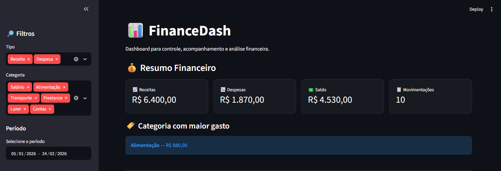
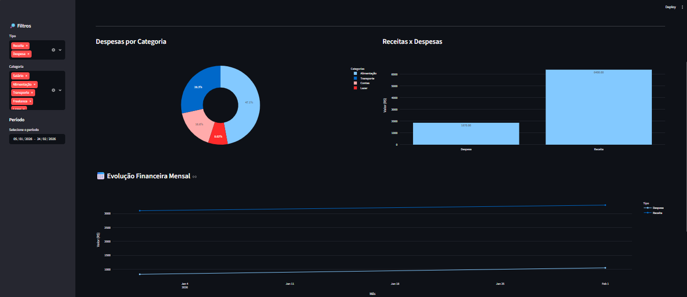
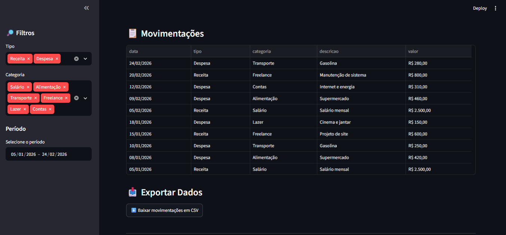

# FinanceDash

Dashboard financeiro desenvolvido em **Python** para análise de receitas, despesas, saldo e movimentações financeiras.

O projeto utiliza **Streamlit**, **Pandas** e **Plotly** para transformar dados financeiros em indicadores, gráficos e tabelas interativas.

## Funcionalidades

- Visualização de receitas totais
- Visualização de despesas totais
- Cálculo automático do saldo
- Contagem de movimentações
- Identificação da categoria com maior gasto
- Filtro por tipo de movimentação
- Filtro por categoria
- Filtro por período
- Gráfico de despesas por categoria
- Comparação entre receitas e despesas
- Evolução financeira mensal
- Tabela completa de movimentações
- Exportação dos dados filtrados em CSV
- Interface responsiva e interativa

## Tecnologias utilizadas

- Python
- Pandas
- Streamlit
- Plotly
- CSV

## Estrutura do projeto

```text
FinanceDash/
├── app.py
├── requirements.txt
├── README.md
├── dados/
│   └── financeiro.csv
└── docs/
    └── images/
        ├── resumo.png
        ├── graficos.png
        └── movimentacoes.png
```

## Dashboard

### Resumo Financeiro

Indicadores principais de receitas, despesas, saldo, movimentações e categoria com maior gasto.



### Gráficos

Visualização das despesas por categoria e comparação entre receitas e despesas.



### Movimentações

Tabela com os registros financeiros e opção para exportar os dados em CSV.



## Dados

O dashboard utiliza um arquivo CSV contendo informações como:

- Data
- Tipo da movimentação
- Categoria
- Descrição
- Valor

Os dados utilizados no projeto são fictícios e foram criados apenas para demonstração.

## Como executar

Instale as dependências:

```bash
python -m pip install -r requirements.txt
```

Depois execute:

```bash
python -m streamlit run app.py
```

## Site online

Acesse a versão publicada do dashboard:

https://financedash-martchellinho.streamlit.app/

## Objetivo do projeto

O FinanceDash foi desenvolvido como projeto de portfólio para aplicar conhecimentos de:

- Python
- Análise de dados
- Manipulação de arquivos CSV
- Criação de dashboards
- Filtros de dados
- Visualização de informações
- Criação de gráficos
- Organização financeira

## Possíveis melhorias futuras

- Cadastro de movimentações pelo próprio dashboard
- Banco de dados
- Login de usuários
- Metas financeiras
- Orçamento mensal
- Comparação entre diferentes anos
- Relatórios em PDF
- Integração com APIs bancárias

## Autor

Desenvolvido por **Martchellinho**.

GitHub: https://github.com/Martchellinho